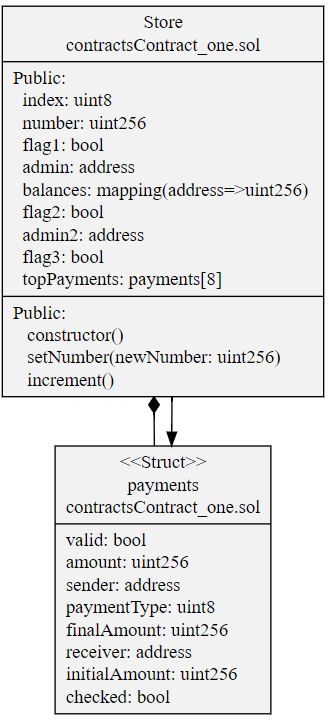
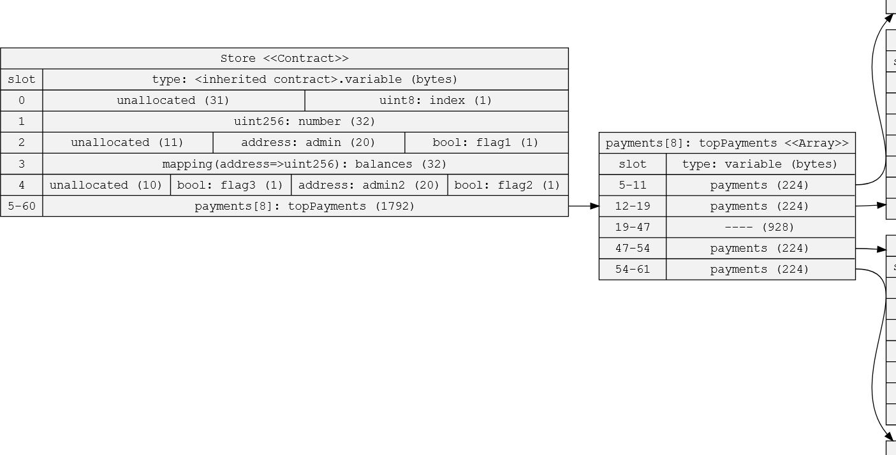
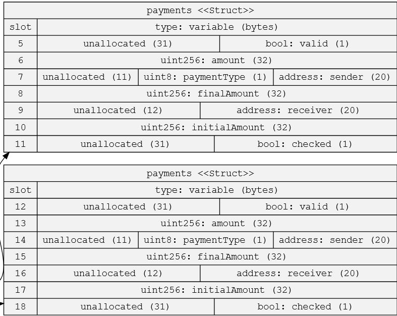
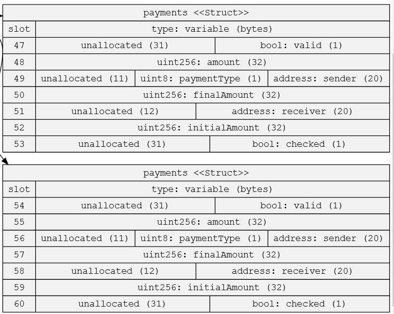
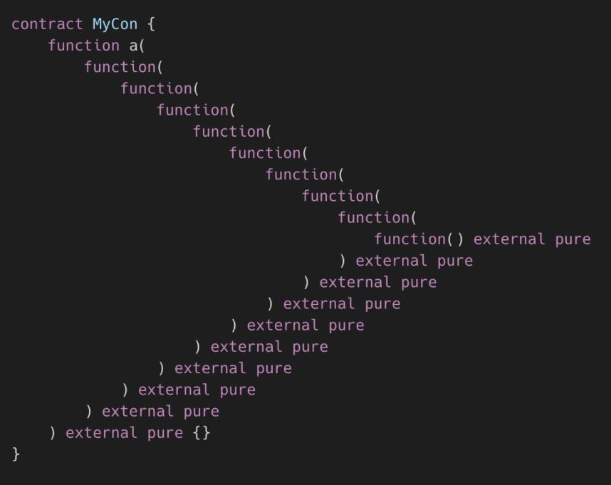

Homework 4
Optimising Storage

QUESTION 1
Take this contract

    // SPDX-License-Identifier: UNLICENSED
    pragma solidity ^0.8.13;

    contract Store {

        struct payments {
            bool valid;
            uint256 amount;
            address sender;
            uint8 paymentType;
            uint256 finalAmount;
            address receiver;
            uint256 initialAmount;
            bool checked;
        }
        uint8 index;
        uint256 public number;
        bool flag1;
        address admin;
        mapping (address=>uint256) balances;
        bool flag2;
        address admin2;
        bool flag3;
        payments[8] topPayments;

        constructor(){

        }

        function setNumber(uint256 newNumber) public {
            number = newNumber;
        }

        function increment() public {
            number++;
        }
    }

Use the sol2uml tool to find out how many storage slots it is
using.

    https://github.com/naddison36/sol2uml

By re ordering the variables, can you reduce the number of
storage slots needed ?

sol2uml output for the contract:

sol2uml storage output for the contract:

---

QUESTION 2
Foundry Introduction
. Install Foundry

See Instructions

    https://github.com/foundry-rs/foundry#installation

First run the command below to get foundryup , the
Foundry toolchain installer:

curl -L https://foundry.paradigm.xyz | bash
If you do not want to use the redirect, feel free to
manually download the foundryup installation script
from here.

    https://raw.githubusercontent.com/foundry-rs/foundry/master/foundryup/install

Then, run foundryup in a new terminal session or after
reloading your PATH .
Other ways to use foundryup , and other documentation,
can be found here.

    https://github.com/foundry-rs/foundry/tree/master/foundryup

. Create a project

. Use forge init <project_name> for the default
template or

. Use this template

    https://github.com/PaulRBerg/foundry-template

. Run the tests supplied to familiarise yourself with
Foundry
Try out the Solidity Template or the Foundry Template

. Start a new project using the Solidity Template

. Make a fork of mainnet from the command line (you may
need to setup an Infura or Alchemy account)

. Query the mainnet using the command line to retrieve a
property such as latest block number.

---

QUESTION 3
Is this valid solidity ?
--> image.png

